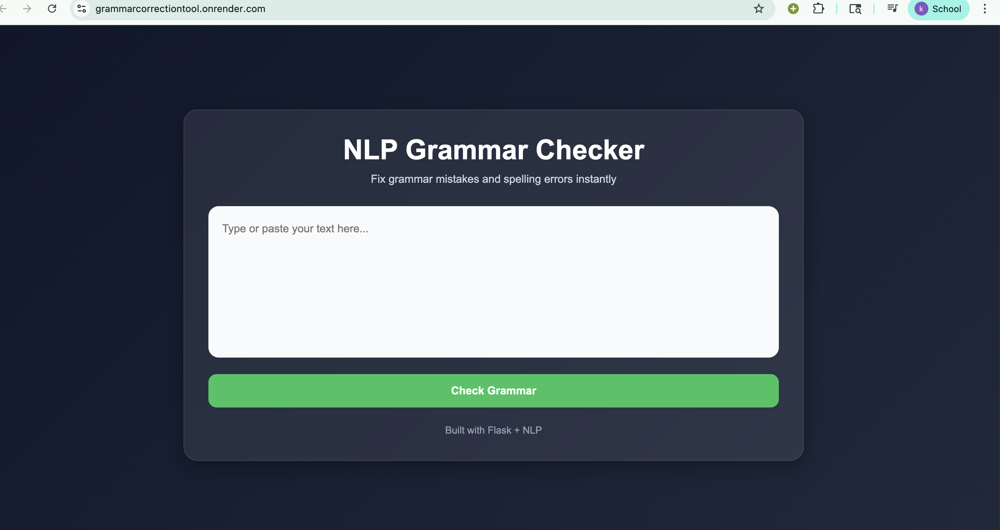

# 🧠 NLP Grammar & Spell Checker

<p align="center">
  
</p>

<p align="center">
  <b>Detect • Correct • Improve Writing Instantly ✨</b><br/>
  A Flask-based NLP web app that identifies and corrects grammar & spelling mistakes in real time.
</p>

<p align="center">
  
  
  
  
</p>

---

## 🚀 Live Demo

<!-- <p align="center">
  
</p> -->

```md
▶️ Watch Demo: https://screenapp.io/app/v/1NdF-7pEoq

---

## ✨ Features

- 📝 Grammar error detection  
- 🔤 Spell checking with smart suggestions  
- 🌐 Clean and responsive web interface  
- ⚡ Fast NLP processing using LanguageTool  
- 🔧 Easy to customize and extend  


---

⚙️ Installation & Setup
1️⃣ Clone Repository
git clone https://github.com/KomalMaurya/GrammarCorrectionTool
cd GrammarCorrectionTool
2️⃣ Create Virtual Environment (IMPORTANT)

Recommended to isolate dependencies

Windows
python -m venv venv
venv\Scripts\activate
Mac / Linux
python3 -m venv venv
source venv/bin/activate
3️⃣ Install Dependencies
pip install flask language-tool-python
4️⃣ Run Application
python app.py
5️⃣ Open in Browser
http://127.0.0.1:5000/
