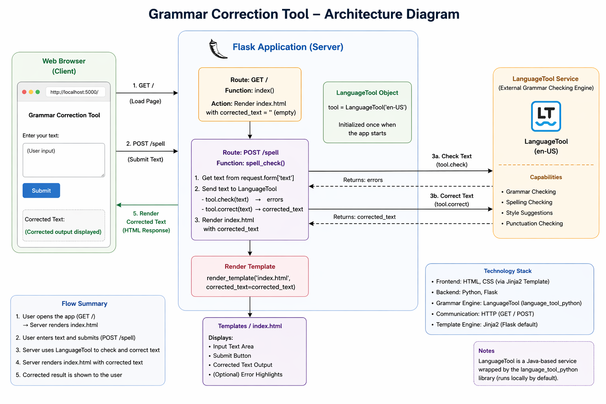

# 🧠 NLP Grammar & Spell Checker

<p align="center">
  
</p>

<p align="center">
  <b>Detect • Correct • Improve Writing Instantly ✨</b><br/>
  A Flask-based NLP web application that identifies and corrects grammar & spelling mistakes in real time.
</p>

<p align="center">
  
  
  
  
</p>

---

## 🚀 Live Demo

▶️ [Watch Demo](https://screenapp.io/app/v/1NdF-7pEoq)

---

## ✨ Features

- 📝 **Grammar error detection**  
- 🔤 **Spell checking** with smart suggestions  
- 🌐 **Clean and responsive** web interface  
- ⚡ **Fast NLP processing** using LanguageTool  
- 🔧 **Easy to customize** and extend  

---

## ⚙️ Installation & Setup

Follow these steps to run the project locally:

### 1️⃣ Clone the Repository

```bash
git clone [https://github.com/KomalMaurya/GrammarCorrectionTool](https://github.com/KomalMaurya/GrammarCorrectionTool)
cd GrammarCorrectionTool

### 2️⃣ Create Virtual Environment (IMPORTANT)
Recommended to isolate dependencies and avoid conflicts.

**Windows:**
```bash
python -m venv venv
venv\Scripts\activate
```

**Mac / Linux:**
```bash
python3 -m venv venv
source venv/bin/activate
```

### 3️⃣ Install Dependencies

```bash
pip install flask language-tool-python
```

### 4️⃣ Run the Application
```bash
python app.py
```

### 5️⃣ Open in Browser
Visit [http://127.0.0.1:5000/](http://127.0.0.1:5000/)

---

## 🧠 How It Works

1. User Input
2. Flask Backend (Python)
3. LanguageTool NLP Engine
4. Grammar & Spell Detection
5. Corrected Output
6. Displayed on Web UI

<p align="center">
  
</p>
---

## 📁 Project Structure
```text
GrammarCorrectionTool/
│
├── app.py
├── templates/
│   └── index.html
├── static/
│   └── style.css
├── assets/
│   └── Project_NLP.png
└── README.md
```

---

## 💡 Example

*   **Input:** `She go to school every day.`
*   **Output:** `She goes to school every day.`

---

## 🛑 Stop the Application

*   To stop the running Flask server: `Ctrl + C`
*   To close terminal completely: `exit`

---

## 🔮 Future Improvements

*   🤖 AI-based sentence rewriting (Grammarly-like suggestions)
*   🌍 Multi-language support
*   🌙 Dark mode UI
*   📱 Mobile responsive design
*   ☁️ Cloud deployment (Render / AWS / Vercel)
*   🔌 Browser extension support

---

## 🤝 Contributing

1. Fork the repository
2. Create a new branch
3. Make changes
4. Submit a Pull Request

---

## ⭐ Support
If you like this project, consider giving it a ⭐ on GitHub.
